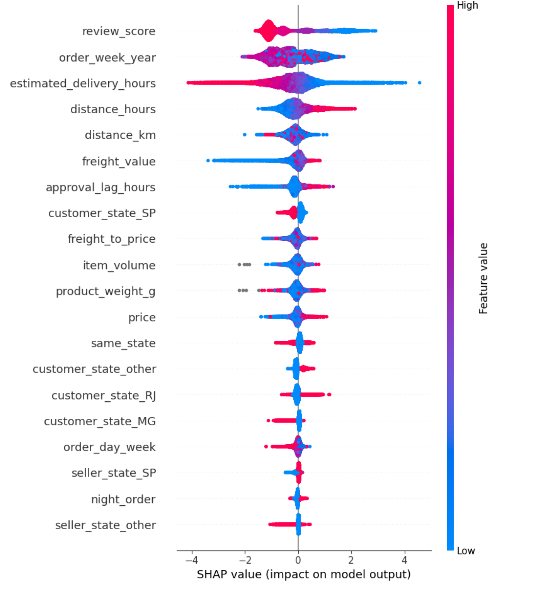
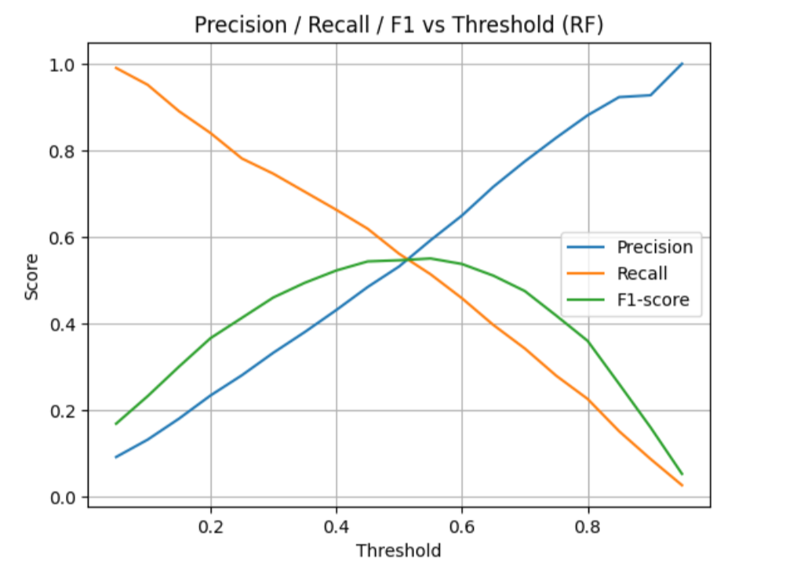

# 📦 Olist Late Delivery Classification  

## 📌 Overview  
This project predicts whether an order in the **Olist Brazilian E-Commerce Dataset** will be delivered late.  
The dataset contains 100k+ real orders from Brazil, with information about customers, sellers, logistics, and reviews.  

The goal is to use **machine learning** to classify orders as **on-time** or **late**, helping e-commerce platforms anticipate delivery issues and improve customer satisfaction.  

---

## 🛠️ Tech Stack  
- Python (pandas, numpy, scikit-learn, matplotlib, seaborn)  
- ML Models: XGBoost, Random Forest, LightGBM, CatBoost  
- SHAP for model interpretability  
- Jupyter Notebook  

---

## 📂 Dataset  
- Source: [Olist Brazilian E-Commerce Public Dataset on Kaggle](https://www.kaggle.com/datasets/olistbr/brazilian-ecommerce)  
- Contains orders, customers, sellers, reviews, payments, and logistics data.  

⚠️ Due to size limits, the full dataset is **not included** in this repo. Please download it directly from Kaggle.  
A small sample (`data/sample_orders.csv`) may be provided to illustrate structure.  

---

## 🚀 Workflow  

### 1. Data Preparation  
- Loaded and merged multiple CSVs from Olist dataset.  
- Filtered only **delivered orders**.  
- Converted timestamps to datetime.  
- Removed unused IDs and raw coordinate columns.  

### 2. Feature Engineering  
- **Distance features**:  
  - `distance_km` → haversine distance between customer & seller.  
  - `distance_hours` = distance / estimated delivery hours.  
- **Time features**: order weekday, order week of year, approval lag hours.  
- **Flags**: same state / different state, night order, weekend order.  
- **Logistics & price features**: freight value, freight-to-price ratio, item volume, product weight.  

### 3. Modeling  
Trained and evaluated multiple classifiers:  
- **XGBoost (baseline)**  
- **Random Forest**  
- **LightGBM**  
- **CatBoost**  

Evaluation metrics: Accuracy, F1-score, ROC AUC.  

---

## 📊 Results  

| Model        | Accuracy | F1-score | ROC AUC |
|--------------|----------|----------|---------|
| XGBoost      | 0.867    | 0.456    | 0.874   |
| Random Forest| **0.927**| **0.547**| **0.889** |
| LightGBM     | 0.923    | 0.528    | 0.882   |
| CatBoost     | 0.883    | 0.467    | 0.874   |

✅ **Best Model: Random Forest**  
- Accuracy: **92.7%**  
- F1: **0.55** (better balance on late orders vs majority class)  
- ROC AUC: **0.89**  

---

## 🔍 Model Insights  

### Feature Importance (SHAP)  
  

- Top features: `review_score`, `order_week_year`, `estimated_delivery_hours`, `distance_hours`, `distance_km`.  
- Customer reviews and delivery times strongly influence whether an order is late.  

### Precision–Recall Tradeoff  
  

- Precision increases at higher thresholds, while recall drops.  
- F1-score peaks around threshold ~0.5, showing a balance point.  

---

## 📎 Repository Structure  
